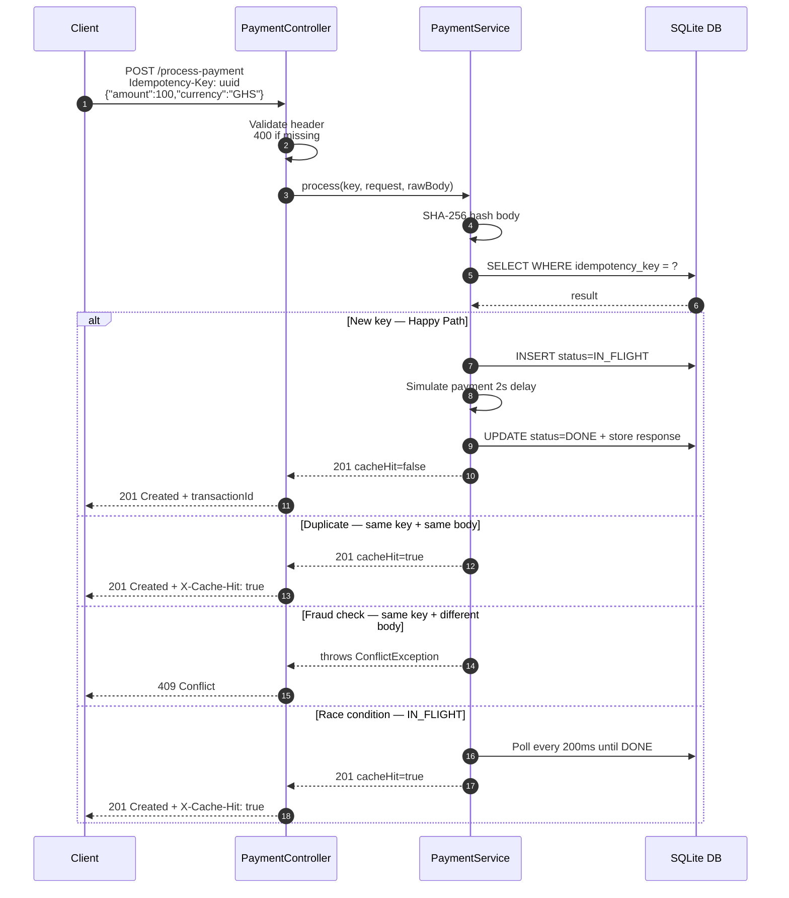
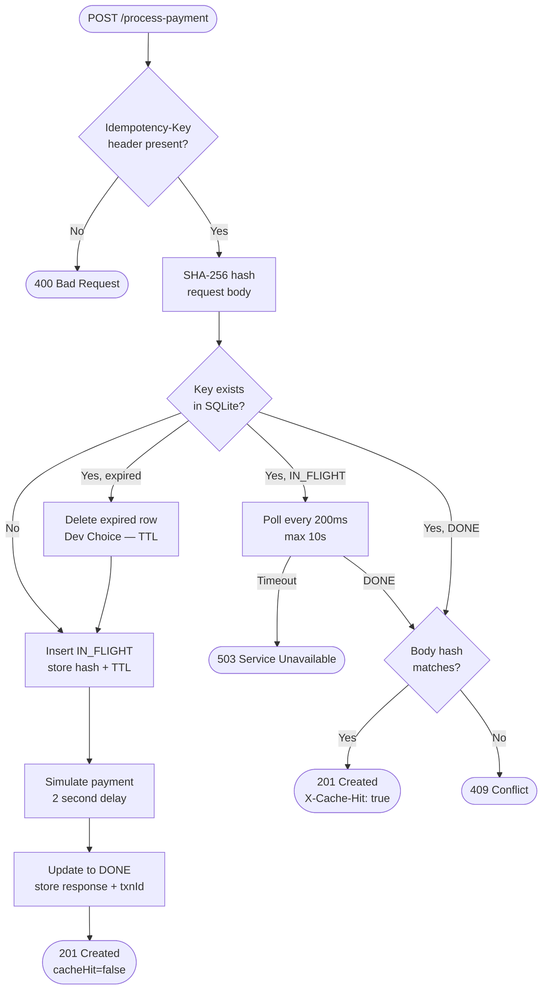

# 🔐 Idempotency Gateway — FinSafe Pay-Once Protocol

> A production-grade idempotency layer built with **Spring Boot 3**, **SQLite**, and **Maven**.  
> Ensures every payment request is processed **exactly once**, no matter how many times the client retries.

---

## 📋 Table of Contents

- [Overview](#overview)
- [Architecture Diagram](#architecture-diagram)
- [Project Structure](#project-structure)
- [Tech Stack](#tech-stack)
- [Setup & Installation](#setup--installation)
- [Running the Application](#running-the-application)
- [API Documentation](#api-documentation)
- [Swagger UI](#swagger-ui)
- [Testing All Scenarios](#testing-all-scenarios)
- [Design Decisions](#design-decisions)
- [Developer's Choice — Key Expiry TTL](#developers-choice--key-expiry-ttl)
- [User Stories Coverage](#user-stories-coverage)

---

## Overview

FinSafe's clients (e-commerce shops) occasionally experience network timeouts. When this happens, their servers automatically retry sending payment requests — causing **double charging**.

This service solves that problem by implementing an **Idempotency Layer**:

| Scenario | What happens |
|----------|-------------|
| First request | Payment processed, response stored against key |
| Duplicate retry (same key + same body) | Cached response returned instantly — no re-processing |
| Same key + different body | `409 Conflict` — fraud/error protection |
| Concurrent duplicate (race condition) | Second request waits for first to finish, then replays result |
| Expired key (after 24h) | Key treated as new — fresh processing |

---

## Architecture Diagram

### Sequence Diagram — Request Lifecycle



### Flowchart — Decision Logic



---

## Project Structure

```
idempotency-gateway/
├── mvnw                    ← Maven wrapper (Mac/Linux)
├── mvnw.cmd                ← Maven wrapper (Windows)
├── pom.xml
├── .gitignore
└── src/
    ├── main/
    │   ├── java/com/finsafe/gateway/
    │   │   ├── IdempotencyGatewayApplication.java
    │   │   ├── controller/
    │   │   │   └── PaymentController.java
    │   │   ├── service/
    │   │   │   └── PaymentService.java
    │   │   ├── repository/
    │   │   │   └── IdempotencyRepository.java
    │   │   ├── model/
    │   │   │   ├── IdempotencyRecord.java
    │   │   │   ├── PaymentRequest.java
    │   │   │   └── PaymentResponse.java
    │   │   ├── exception/
    │   │   │   ├── IdempotencyConflictException.java
    │   │   │   └── InFlightTimeoutException.java
    │   │   └── config/
    │   │       ├── HashUtil.java
    │   │       ├── OpenApiConfig.java
    │   │       └── GlobalExceptionHandler.java
    │   └── resources/
    │       ├── application.properties
    │       └── schema.sql
    └── test/
        └── java/com/finsafe/gateway/
            └── IdempotencyGatewayIntegrationTest.java
```

---

## Tech Stack

| Technology | Version | Purpose |
|-----------|---------|---------|
| Java | 17 | Core language |
| Spring Boot | 3.2.5 | Web framework + auto-configuration |
| Spring JDBC | 6.1.6 | Database access via JdbcTemplate |
| SQLite | 3.43.0.0 | Embedded persistent database |
| HikariCP | 5.0.1 | Connection pooling |
| SpringDoc OpenAPI | 2.1.0 | Swagger UI documentation |
| Maven | 3.9+ | Build tool |
| JUnit 5 | 5.10 | Integration testing |

---

## Setup & Installation

### Prerequisites

| Tool | Version |
|------|---------|
| Java JDK | 17 or higher |
| Maven | 3.8+ *(or use bundled `mvnw`)* |

> **No database setup needed.** SQLite is embedded — `idempotency.db` is created automatically on first startup.

### Clone the Repository

```bash
git clone https://github.com/Girineza250/AmaliTech-DEG-Project-based-challenges.git
cd AmaliTech-DEG-Project-based-challenges/backend/Idempotency-gateway
```

---

## Running the Application

### Windows

```bash
mvnw.cmd spring-boot:run
```

### Mac / Linux

```bash
./mvnw spring-boot:run
```

### Confirm it started

Look for these lines in the console:

```
HikariPool-1 - Start completed.
Tomcat started on port 8080 (http)
Started IdempotencyGatewayApplication in X seconds
```

Server is live at: **`http://localhost:8080`**

### Run Tests

```bash
# Windows
mvnw.cmd test

# Mac / Linux
./mvnw test
```

### Configuration

All settings are in `src/main/resources/application.properties`:

```properties
server.port=8080
spring.datasource.url=jdbc:sqlite:./idempotency.db
idempotency.ttl-minutes=1440
idempotency.poll-interval-ms=200
idempotency.max-wait-ms=10000
```

| Property | Default | Description |
|----------|---------|-------------|
| `idempotency.ttl-minutes` | `1440` | Key lifetime — 24 hours |
| `idempotency.poll-interval-ms` | `200` | How often to check IN_FLIGHT status |
| `idempotency.max-wait-ms` | `10000` | Max wait for IN_FLIGHT request — 10 seconds |
| `server.port` | `8080` | HTTP port |

---

## API Documentation

### Base URL

```
http://localhost:8080
```

### Endpoint

| Method | URL | Description |
|--------|-----|-------------|
| `POST` | `/process-payment` | Process a payment with idempotency protection |

---

### `POST /process-payment`

#### Request Headers

| Header | Required | Description | Example |
|--------|----------|-------------|---------|
| `Content-Type` | Yes | Must be `application/json` | `application/json` |
| `Idempotency-Key` | **Yes** | Unique string for this operation — use a UUID | `550e8400-e29b-41d4-a716-446655440000` |

#### Request Body

```json
{
  "amount": 100,
  "currency": "GHS"
}
```

| Field | Type | Required | Validation |
|-------|------|----------|------------|
| `amount` | `number` | Yes | Must be `> 0` |
| `currency` | `string` | Yes | Any non-blank string |

---

#### Response Reference

| Status Code | Condition | Response Headers | Response Body |
|-------------|-----------|-----------------|---------------|
| `201 Created` | First successful request | — | `{"status":"Charged 100.0 GHS","transactionId":"txn_..."}` |
| `201 Created` | Duplicate retry — same key + same body | `X-Cache-Hit: true` | Identical to first response |
| `400 Bad Request` | Missing `Idempotency-Key` header | — | `{"error":"Idempotency-Key header is required."}` |
| `400 Bad Request` | Invalid or empty body | — | `{"error":"Validation failed: ..."}` |
| `409 Conflict` | Same key + different body | — | `{"error":"Idempotency key already used for a different request body."}` |
| `503 Service Unavailable` | IN_FLIGHT timeout exceeded | — | `{"error":"Request is still processing after 10000ms."}` |

---

### Example Requests

#### ✅ User Story 1 — First Transaction (Happy Path)

```http
POST /process-payment HTTP/1.1
Host: localhost:8080
Content-Type: application/json
Idempotency-Key: 550e8400-e29b-41d4-a716-446655440000

{
  "amount": 100,
  "currency": "GHS"
}
```

**Response — `201 Created`**

```json
{
  "status": "Charged 100.0 GHS",
  "transactionId": "txn_a3f9c21d88b1"
}
```

---

#### ✅ User Story 2 — Duplicate Retry (Idempotency Replay)

Same request as above — **identical key and body**.

**Response — `201 Created` with `X-Cache-Hit: true`**

```json
{
  "status": "Charged 100.0 GHS",
  "transactionId": "txn_a3f9c21d88b1"
}
```

> The `transactionId` is **identical** to the first response.  
> No payment processing occurred. Response served from cache instantly.

---

#### ✅ User Story 3 — Fraud Check (Different Body, Same Key)

```http
POST /process-payment HTTP/1.1
Host: localhost:8080
Content-Type: application/json
Idempotency-Key: 550e8400-e29b-41d4-a716-446655440000

{
  "amount": 500,
  "currency": "GHS"
}
```

**Response — `409 Conflict`**

```json
{
  "error": "Idempotency key already used for a different request body."
}
```

---

#### ❌ Missing Header

```http
POST /process-payment HTTP/1.1
Host: localhost:8080
Content-Type: application/json

{
  "amount": 100,
  "currency": "GHS"
}
```

**Response — `400 Bad Request`**

```json
{
  "error": "Idempotency-Key header is required."
}
```

---

#### ⚡ Bonus — Race Condition (IN_FLIGHT Check)

Send the **same request twice simultaneously**:

- **Request A** arrives → inserted as `IN_FLIGHT` → starts 2-second processing
- **Request B** arrives with **same key** → detects `IN_FLIGHT` → polls every 200ms
- When Request A completes → Request B gets the **same result**
- Both return `201 Created` with the **same `transactionId`**
- Request B has `X-Cache-Hit: true`

---

### Postman Quick Start

1. Open Postman → New Request → **POST**
2. URL: `http://localhost:8080/process-payment`
3. **Headers** tab:

| Key | Value |
|-----|-------|
| `Content-Type` | `application/json` |
| `Idempotency-Key` | `550e8400-e29b-41d4-a716-446655440000` |

4. **Body** tab → **raw** → **JSON**:

```json
{
  "amount": 100,
  "currency": "GHS"
}
```

5. Click **Send**

---

## Swagger UI

Interactive API documentation is available once the server is running.

### Access

```
http://localhost:8080/swagger-ui.html
```

### API Docs (JSON)

```
http://localhost:8080/api-docs
```

### How to use Swagger UI

1. Open `http://localhost:8080/swagger-ui.html` in your browser
2. Click **POST /process-payment** to expand the endpoint
3. Click **Try it out**
4. Fill in the **Idempotency-Key** field — e.g. `test-key-001`
5. In the **Request body** section, pick an example from the dropdown:
   - `GHS Payment` — `{"amount": 100, "currency": "GHS"}`
   - `USD Payment` — `{"amount": 250, "currency": "USD"}`
   - `EUR Payment` — `{"amount": 75, "currency": "EUR"}`
6. Click **Execute**
7. See the response below — status code, headers, and body

> All response scenarios are documented in Swagger — `201`, `400`, `409`, `503`.

---

## Testing All Scenarios

### Run automated integration tests

```bash
# Windows
mvnw.cmd test

# Mac / Linux
./mvnw test
```

All 8 tests should pass covering:

| Test | Scenario |
|------|---------|
| `firstRequestReturns201` | US1 — Happy path |
| `missingHeaderReturns400` | US1 — Missing header |
| `duplicateRequestReplaysCachedResponse` | US2 — Idempotency replay |
| `duplicateRequestIsInstant` | US2 — No 2s delay on cache hit |
| `differentBodyReturns409` | US3 — Fraud check |
| `concurrentRequestWaitsForInFlight` | Bonus — Race condition |
| `hashUtilIsDeterministic` | HashUtil — SHA-256 correctness |
| `hashUtilDetectsDifference` | HashUtil — Body change detection |

---

## Design Decisions

### Why SHA-256 for body comparison?

Instead of storing the entire raw request body, we hash it with SHA-256 and store only the 64-character hex digest. This keeps the database lean regardless of request body size, while providing collision-resistant equality detection.

### Why SQLite instead of in-memory store?

An in-memory `ConcurrentHashMap` loses all state on server restart. If the server crashes mid-payment while a record is `IN_FLIGHT`, the client would retry and get double-charged. SQLite gives the idempotency store **durability** — the `IN_FLIGHT` record survives restarts.

### Why Spring JDBC instead of JPA/Hibernate?

The schema is a single table with straightforward CRUD. JPA's overhead — entity managers, session factories, dialect quirks with SQLite — adds complexity with zero benefit. `JdbcTemplate` keeps the SQL explicit and SQLite-compatible.

### Why poll SQLite for the race condition?

A `ReentrantLock` keyed by idempotency key works in a single-server setup but breaks when you scale to multiple pods behind a load balancer. SQLite polling works across any number of instances pointing at a shared database — the more production-realistic approach.

### Why `synchronized` on the idempotency key?

Within the same JVM, two threads with the same key could both pass the "key not found" check simultaneously and both try to insert an `IN_FLIGHT` record. The `synchronized` block using `String.intern()` prevents this at the JVM level. SQLite's single-connection pool handles it at the database level.

### Why `CREATE TABLE IF NOT EXISTS`?

The schema runs on every startup. `IF NOT EXISTS` makes it safe to re-run without wiping existing records, so the server can restart without losing idempotency state.

---

## Developer's Choice — Key Expiry TTL

**The problem:** Without expiry, idempotency keys accumulate forever. A Fintech system processing millions of payments daily would see unbounded database growth. Additionally, legitimate merchants running daily batch jobs may want to reuse the same logical key identifier after a window closes — without TTL they get a permanent `409 Conflict`.

**The implementation:**

- Every new record stores `expires_at = created_at + ttl-minutes`
- On every lookup, if `expires_at < NOW` the record is deleted and treated as absent
- A `@Scheduled` task runs daily at `02:00` and bulk-deletes all expired rows
- TTL is configurable via `idempotency.ttl-minutes` in `application.properties`

**Why 24 hours?**

Stripe uses a 24-hour idempotency window. Long enough to cover all realistic network retry scenarios (typically under 1 minute) while preventing unbounded accumulation.

---

## User Stories Coverage

| Story | Requirement | Status |
|-------|-------------|--------|
| US1 | `POST /process-payment` accepts `Idempotency-Key` header | ✅ |
| US1 | Simulates 2-second processing delay | ✅ |
| US1 | Returns `"Charged 100.0 GHS"` in response body | ✅ |
| US1 | Returns `201 Created` | ✅ |
| US2 | Duplicate returns same response body | ✅ |
| US2 | No re-processing on duplicate — instant response | ✅ |
| US2 | Returns `X-Cache-Hit: true` header | ✅ |
| US3 | Same key + different body returns `409 Conflict` | ✅ |
| US3 | Correct error message returned | ✅ |
| Bonus | Concurrent IN_FLIGHT request waits — does not return `409` | ✅ |
| Bonus | Waiting request returns same result as original | ✅ |
| Dev's Choice | Key TTL expiry with scheduled cleanup | ✅ |

---

## License

MIT License — see [LICENSE](LICENSE) for details.
